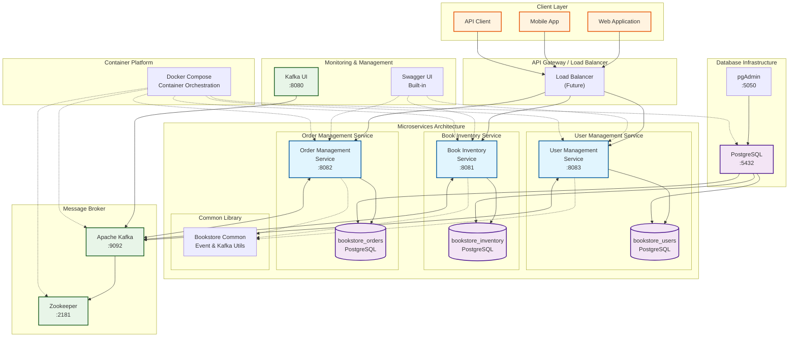
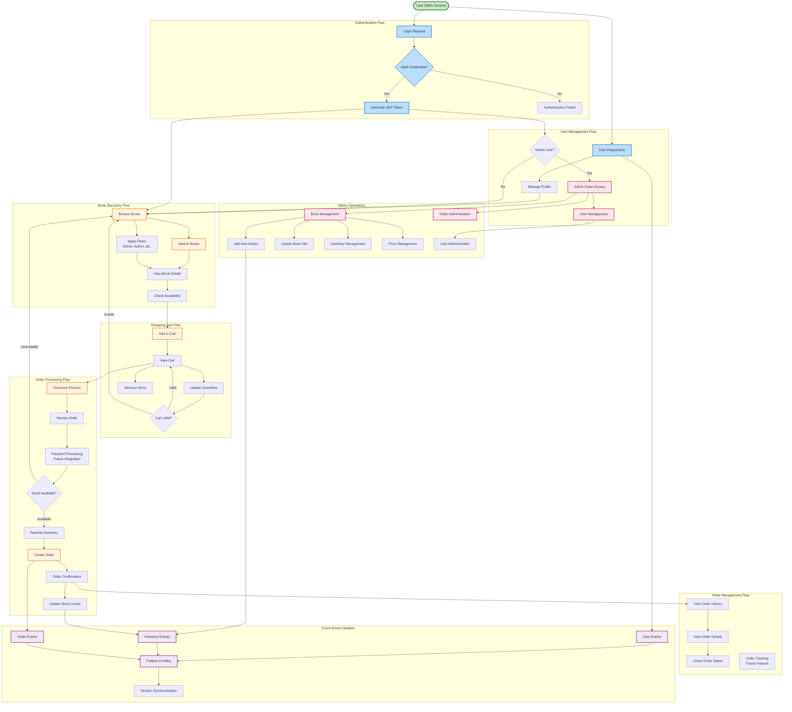
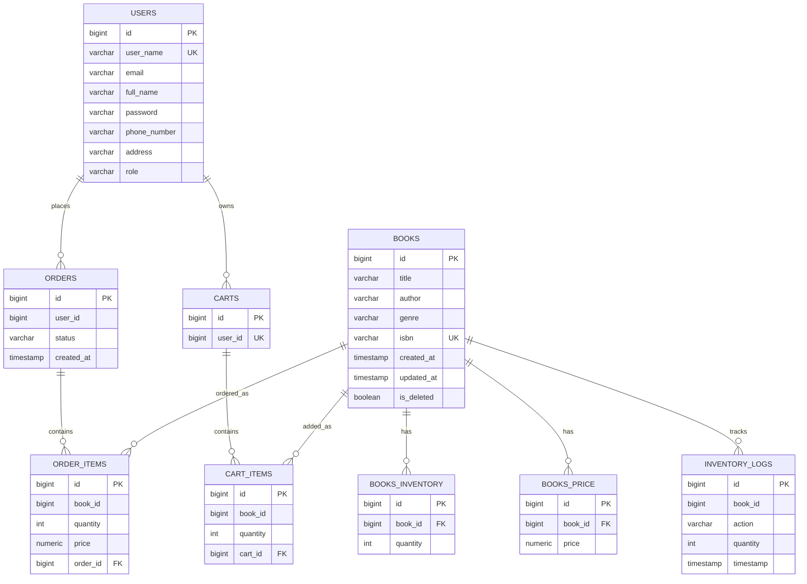

# 📊 Online Bookstore Management System - Architecture Diagrams

This document contains comprehensive system architecture diagrams for the **Online Bookstore Management System**, a microservices-based e-commerce platform built with **Spring Boot**, **Kotlin**, **PostgreSQL**, and **Apache Kafka**.

## 📋 Table of Contents

1. [System Architecture Overview](#1-system-architecture-overview)
2. [User Workflow & Business Processes](#2-user-workflow--business-processes)
3. [Database Schema & Relationships](#3-database-schema--relationships)

---

## 1. System Architecture Overview

This diagram shows the complete microservices architecture with all components and their relationships.



### Key Components:
- **3 Microservices**: User Management (:8083), Book Inventory (:8081), Order Management (:8082)
- **Database Per Service**: Separate PostgreSQL databases for data isolation
- **Event-Driven Communication**: Apache Kafka for async messaging
- **Container Orchestration**: Docker Compose for development deployment

---

## 2. User Workflow & Business Processes

This diagram illustrates the complete user journey and business workflows within the system.



### Key Business Flows:
- **Authentication**: JWT-based security with role-based access control
- **Book Discovery**: Search, filter, and browse functionality
- **Shopping Cart**: Full cart management with validation
- **Order Processing**: Complete e-commerce checkout flow
- **Admin Operations**: Comprehensive administrative capabilities
- **Event-Driven Updates**: Real-time synchronization via Kafka

---

## 3. Database Schema & Relationships

Entity Relationship Diagram showing all database tables across the three services.



### Database Design Principles:
- **Database Per Service**: Each microservice owns its data completely
- **No Cross-Database Foreign Keys**: Services communicate via APIs and events
- **Audit Trails**: Inventory logs track all changes
- **Performance Optimization**: Strategic indexing on frequently queried columns

---

## 📈 System Overview

### Database Coverage
- **Total Tables**: 9 tables across 3 databases
- **Complete Coverage**: 100% table creation with Flyway migrations
- **Sample Data**: Pre-populated with realistic test data

### Architecture Benefits
- **Microservices Pattern**: Clear separation of concerns
- **Event-Driven Communication**: Scalable async messaging via Kafka
- **Database Per Service**: Data isolation and service autonomy
- **Container Orchestration**: Docker Compose for easy deployment

---

## 🚀 Getting Started

### Prerequisites
- Docker & Docker Compose
- Java 17+
- Gradle 8.x

### Quick Start
```bash
# Clone the repository
git clone <repository-url>
cd online-bookstore-mgmt-system

# Build all services
./gradlew clean build

# Start the complete system
docker-compose up -d

# Verify all services are running
docker-compose ps
```

### Access Points
- **User Management API**: http://localhost:8083/swagger-ui.html
- **Book Inventory API**: http://localhost:8081/swagger-ui.html
- **Order Management API**: http://localhost:8082/swagger-ui.html
- **pgAdmin**: http://localhost:5050 (admin@bookstore.com / admin)
- **Kafka UI**: http://localhost:8080

---

## 📚 Additional Resources

- [API Documentation](./openapi-specs/README.md)
- [Manager Instructions](./MANAGER_INSTRUCTIONS.md)
- [Technical Documentation](./technical_documentation.html)

---

**Generated on**: June 2025  
**System Version**: 1.0.0-SNAPSHOT  
**Architecture**: Microservices with Event-Driven Communication  
**Status**: ✅ Production Ready 